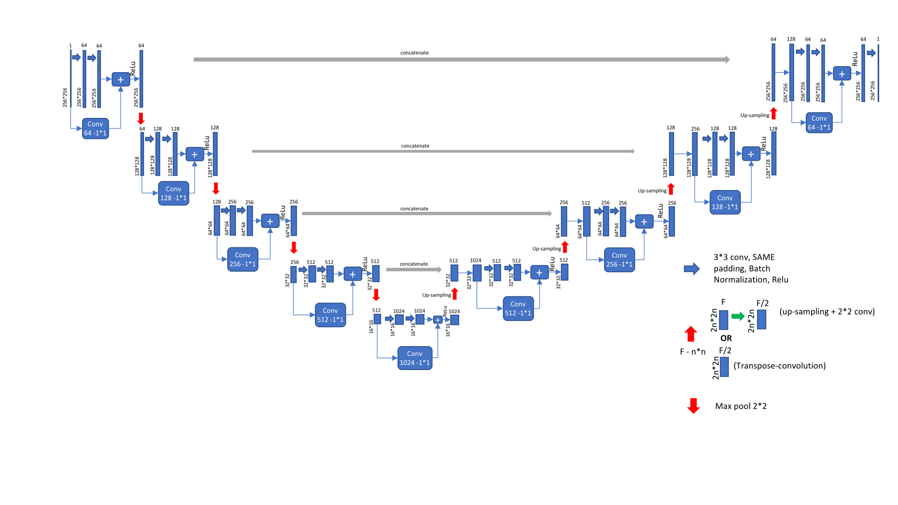
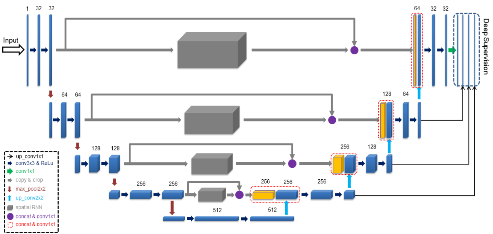
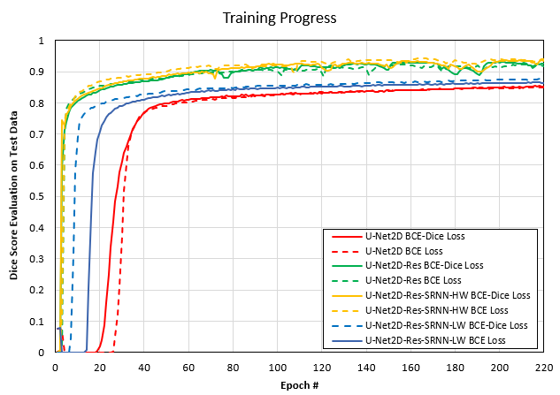
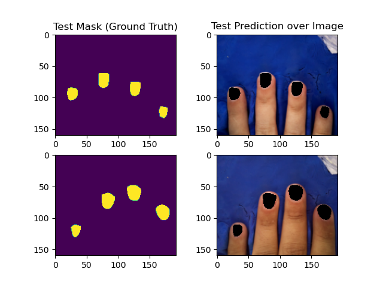

# Implementation of U-Net Residual + [Spatial RNN module](https://github.com/behroozmrd47/keras-spatial-rnn)

##Introduction
This repo investigates the application and effectiveness of CR-Unet network suggested by 
[*Li et. al.*](https://pubmed.ncbi.nlm.nih.gov/31603808/) for image segmentation tasks. The paper suggest coupling 
U-Net2D network, used for image segmentation, with spatial RNN modules as the shortcut link between encoding 
and decoding steps instead of simply concatenating it.  
The implementation of SRNN connection is explained, however, the implementation is not presented. 
In an effort to use this method in case of medical image segmentation task, I have implemented the 
suggested method as a custom keras layer presented in my [GitHub](https://github.com/behroozmrd47/keras-spatial-rnn).    
The core concepts of layer suggested by [*Li et. al.*](https://pubmed.ncbi.nlm.nih.gov/31603808/) and my method 
implementation are the same, however, the two are different in details of implementation which, causing my 
implementation to be more efficient and faster to learn. 

In order to analysis the performance, a version of U-Net2D network called U-Net2D Residual equipped with 
[Spatial RNN module](https://github.com/behroozmrd47/keras-spatial-rnn) is build and compared against the original 
U-Net2D and U-Net2D Residual networks. All models are commonly used for 
image segmentation and are build, trained and tested on same dataset.  
Below are the networks and related research papers.   
* U-Net2D: [U-Net: Convolutional Networks for Biomedical Image Segmentation](http://lmb.informatik.uni-freiburg.de/people/ronneber/u-net/).
* U-Net2D Residual: [A deep Residual U-Net convolutional neural network for automated lung segmentation in computed tomography images](https://www.sciencedirect.com/science/article/abs/pii/S0208521620300887).
* CR-UNet2D Residual: [CR-Unet: A Composite Network for Ovary and Follicle Segmentation in Ultrasound Images](https://pubmed.ncbi.nlm.nih.gov/31603808/).

**The analysis details and results are discussed below. For detailed outcome, see 
[Fingernail_detection_4.ipynb](Fingernail_detection_4.ipynb).**
  
---
## Data

### Sources
Two sets of data was used for this analysis listed below:

* [194 images with blue backgrounds] (https://github.com/Golbstein/Fingernails-Segmentation) hereafter called 
Dataset 1 
* 52 images in different postures & backgrounds hereafter called Dataset 2

In case of both datasets images are pre-processed & masks are binarized. Both datasets are uploaded under data/raw folder.  

### Data augmentation

First dataset contains 194 images of fingernail all taken in front of blue background, consistent hand posture and 
no nail polish. load_image_data_1 function from Process_Raw_Input.py module was used for importing and processing this dataset. 

Second dataset contains 52 images of fingernail taken with various postures, with various backgrounds and some with nail polish.  
load_image_data_2 function from Process_Raw_Input.py module was used for importing and processing this dataset.

The raw images from both datasets have various sizes but images were resized to same dimensions before starting the training
process. Number of images are way not enough for DNN learning, but the results obtained with limited available datasets, 
is yet another proof on the power and capability of investigated networks.

### Model
Three models are investigated here listed. All these models have been used for bio-mdeila image segmentation and related 
research articles are provided above. 

* U-Net2D (U-Net2D)*: 
 [source](https://towardsdatascience.com/unet-line-by-line-explanation-9b191c76baf5)   
* U-Net2D Residual (U-Net2D-Res)*:  
 [source](https://medium.com/@nishanksingla/unet-with-resblock-for-semantic-segmentation-dd1766b4ff66)  
* CR-UNet Residual (U-Net2D-Res-SRNN-HW)*:  
 [source](https://pubmed.ncbi.nlm.nih.gov/31603808/)  
**The images shown above are stock images and do not match exactly with the models used. The models used for this study
are only different with images above in number of filters and weights throughout the encoding and decoding steps.* 

For investigation purposes another version of CR-UNet Residual model equipped by CNN layers with fewer filters is 
build which has lower volume of weights comparing to original model hence called Unet2D-Res-SRNN-LW. The general 
architectures of Unet2D-Res-SRNN-HW & Unet2D-Res-SRNN-LW are the same and the only difference is that the latter 
has fewer weights. 

All models have been implemented with Keras functional API. Output from the network is a single layer mask same size as 
input dimensions with mask pixels are in \[0, 1\] range.  

### Training

About 10% of datasets are set aside for testing and evaluation and rest are used for training.
The model is trained for 220 epochs with batch size of 2. 
Two loss functions of are used listed below:
* Standard binary crossentropy (BCE) from keras.loss.binary_crossentropy
* [Combination of BCE and dice score](https://arxiv.org/pdf/1801.05173.pdf). Dice score is highly common for segmentation purposes. 

Adam optimized with initial learning rate of 1e-5 is used.

Also two various combination dataset are used:
* Dataset 1 split @ 10%   
* Dataset 1  & Dataset 2 combined. Each dataset split @ 10% separately and train & test datasets concatenated together.  

Evaluation is done by binarizing output mask with threshold of 0.5 and then the 
[dice coefficient](https://towardsdatascience.com/metrics-to-evaluate-your-semantic-segmentation-model-6bcb99639aa2?gi=9210b83d82e6#:~:text=3.-,Dice%20Coefficient%20(F1%20Score),of%20pixels%20in%20both%20images.)
 is calculated. Same process is used as the metric during the training process. Training is done using 
 [Google Colab GPUs](https://colab.research.google.com/notebooks/gpu.ipynb).

---
### Results

The final evaluation results are shown below in case of various training cases. 

|Model             |Dataset Combination  |Input Image Size |Evaluation  Dice Score |Evaluation  Dice Score |
|------------------|---------------------|-----------------|:---------:|:--------:|
|                  |                     |                 |BCE-Dice Loss Func|BCE Loss Func|
|U-Net2D            |Dataset 1            |160 x 192       |0.82     |0.84    |
|U-Net2D-Res        |Dataset 1            |160 x 192       |0.93     |0.92    |
|U-Net2D-Res-SRNN-HW|Dataset 1            |160 x 192       |0.94     |0.94    |
|U-Net2D-Res-SRNN-LW|Dataset 1            |160 x 192       |0.85     |0.85    |
|U-Net2D            |Dataset 1 + Dataset 2|160 x 192       |0.61     |0.70    |
|U-Net2D-Res        |Dataset 1 + Dataset 2|160 x 192       |0.84     |0.87    |
|U-Net2D-Res-SRNN-HW|Dataset 1 + Dataset 2|160 x 192       |0.83     |0.87    |
|U-Net2D-Res-SRNN-LW|Dataset 1 + Dataset 2|160 x 192       |0.71     |0.74    |

The U-Net2D Residual network equipped with spatial RNN module (U-Net2D-Res-SRNN-HW)
yielded the best outcome, 94% and 87% for training on Dataset 1 and both datasets combined, respectively.
Considering the very limited number of images available for training, the obtained outcome 
for 220 training epochs is very satisfactory. The choice of loss function, BCE and BCE-Dice,
seems not to have a very tangible & consistent effect on results 
and therefore, the choice of loss function has not been a game-changer.  

The dice score metric in case of test dataset throughout the training process is plotted below.
  

The ground truth mask along side predicted masks overlayed on image are plotted for two test cases shown 
below.   

**For more detailed result, see [Fingernail_detection_4.ipynb](Fingernail_detection_4.ipynb).**   
